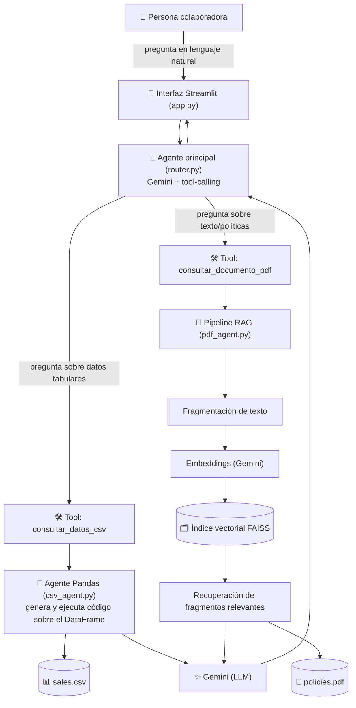

# 🤖 Agente de IA para Documentos Internos

Agente conversacional que responde preguntas en lenguaje natural sobre documentos internos
de una empresa (políticas, manuales, reportes de ventas), sin que la persona usuaria tenga
que abrir ni buscar manualmente en ningún archivo.

**Escenario:** una fintech / consultora / startup tiene grandes volúmenes de documentos
internos (manuales, informes, políticas, hojas de cálculo) y su equipo pierde horas
buscando información dentro de ellos. Este agente centraliza el acceso a esa información
en un chat simple.

## Ejemplo de uso

> **Pregunta:** ¿Cuál fue el producto más vendido en diciembre de 2015?
> **Respuesta:** El agente consulta el CSV de ventas con Pandas y devuelve el resultado exacto.

> **Pregunta:** ¿Qué lenguajes de programación se usan en el back-end de la plataforma?
> **Respuesta:** El agente busca en el PDF de documentación técnica y responde citando la sección correspondiente.

*(Ver la sección [Ejemplos de preguntas y respuestas](#-ejemplos-de-preguntas-y-respuestas) para casos reales, una vez cargados los documentos definitivos.)*

---

## 🏗️ Arquitectura

La idea central: **un solo agente, dos fuentes de datos**. La persona usuaria no necesita
saber si la respuesta está en el CSV o en el PDF — el propio agente decide qué herramienta
usar según la pregunta.



**Flujo resumido:**
1. La persona escribe una pregunta en la interfaz de chat (Streamlit).
2. El agente principal (`router.py`) analiza la pregunta y decide qué herramienta usar.
3. Si es una pregunta tabular, el **agente Pandas** genera y ejecuta código sobre el CSV para calcular la respuesta exacta.
4. Si es una pregunta sobre texto, el **pipeline RAG** busca los fragmentos del PDF más relevantes (vía embeddings + FAISS) y se los pasa al LLM como contexto.
5. Gemini redacta la respuesta final en lenguaje natural y el agente se la devuelve a la persona usuaria.

## 🧰 Stack tecnológico

| Componente | Tecnología |
|---|---|
| Lenguaje | Python 3.12 |
| Orquestación del agente | LangChain 1.x (`langchain-classic` para agentes clásicos) |
| Datos tabulares | Pandas + `langchain-experimental` (agente Pandas) |
| Documentos de texto | RAG con `langchain-community` (loaders) + FAISS (índice vectorial) |
| LLM y embeddings | Google Gemini (`langchain-google-genai`) |
| Interfaz | Streamlit |
| Deploy | Oracle Cloud Infrastructure (OCI), Compute instance Always Free |

## 📁 Estructura del repositorio

```
rag-agent-project/
├── app.py                       # Interfaz de chat (Streamlit) — esto se despliega en OCI
├── src/
│   ├── config.py                 # Configuración centralizada (variables de entorno)
│   ├── csv_agent.py               # Agente Pandas para preguntas sobre datos tabulares
│   ├── pdf_agent.py               # Pipeline RAG para preguntas sobre el PDF
│   ├── router.py                  # Agente principal: decide qué herramienta usar
│   └── main.py                    # Entrypoint por consola (alternativa a Streamlit)
├── data/
│   ├── README.md                  # Dónde poner tus propios CSV/PDF
│   ├── sales.csv                  # (agregalo vos) datos tabulares
│   └── policies.pdf               # (agregalo vos) documento de texto
├── deploy/
│   └── oci_deployment_guide.md    # Guía paso a paso para desplegar en OCI
├── tests/
│   └── test_agent.py              # Pruebas que no requieren API key
├── requirements.txt
├── requirements-dev.txt
├── .env.example
└── README.md
```

## ⚙️ Instalación y ejecución local

### 1. Cloná el repo e instalá dependencias

```bash
git clone https://github.com/<tu-usuario>/<tu-repo>.git
cd <tu-repo>

python3 -m venv venv
source venv/bin/activate      # En Windows: venv\Scripts\activate

pip install -r requirements.txt
```

### 2. Configurá tu API key de Gemini

```bash
cp .env.example .env
```

Editá `.env` y completá `GOOGLE_API_KEY` con tu API key (gratis en [Google AI Studio](https://aistudio.google.com/apikey)).

### 3. Agregá tus documentos

Colocá tu CSV y tu PDF en la carpeta `data/` (ver `data/README.md`), o cambiá las rutas
`CSV_PATH` / `PDF_PATH` en tu `.env` para apuntar a otro lugar.

### 4. Corré la app

**Interfaz de chat (recomendado):**
```bash
streamlit run app.py
```
Abrí `http://localhost:8501` en tu navegador.

**Modo consola:**
```bash
python -m src.main
# o una sola pregunta:
python -m src.main "¿Cuál fue el producto más vendido en diciembre de 2015?"
```

### Variables de entorno

| Variable | Descripción | Default |
|---|---|---|
| `GOOGLE_API_KEY` | API key de Gemini (**requerida**) | — |
| `GEMINI_CHAT_MODEL` | Modelo de chat de Gemini | `gemini-2.0-flash` |
| `GEMINI_EMBEDDING_MODEL` | Modelo de embeddings de Gemini | `models/gemini-embedding-001` |
| `CSV_PATH` | Ruta al archivo CSV | `data/sales.csv` |
| `PDF_PATH` | Ruta al archivo PDF | `data/policies.pdf` |
| `CHUNK_SIZE` / `CHUNK_OVERLAP` | Parámetros de fragmentación del PDF | `1000` / `150` |
| `RETRIEVER_TOP_K` | Cantidad de fragmentos recuperados por pregunta | `4` |

## 🧪 Tests

```bash
pip install -r requirements-dev.txt
pytest tests/ -v
```

Las pruebas cubren la carga de datos y el manejo de errores; no llaman a la API de Gemini
(para no gastar cuota en CI). La calidad de las respuestas del LLM se valida manualmente
probando el agente con preguntas reales.

## 💬 Ejemplos de preguntas y respuestas

> _Sección a completar con capturas reales una vez cargados los documentos definitivos del
> proyecto (ver `data/README.md`). Formato sugerido:_

| Pregunta | Fuente | Respuesta del agente |
|---|---|---|
| ¿Cuál fue el producto más vendido en diciembre de 2015? | CSV | _(pendiente)_ |
| ¿Qué lenguajes de programación se usan en el back-end de la plataforma? | PDF | _(pendiente)_ |
| ¿Cuál es la política de trabajo remoto? | PDF | _(pendiente)_ |

## ☁️ Despliegue en OCI

La app está pensada para desplegarse en una instancia Compute de Oracle Cloud
Infrastructure (alcanza con el **Always Free tier**). La guía completa, paso a paso, está en
[`deploy/oci_deployment_guide.md`](deploy/oci_deployment_guide.md).

**Evidencia del deploy:**

> 🔗 URL pública: `http://<IP_DE_LA_INSTANCIA>:8501` _(completar tras el despliegue)_
>
> 📸 Captura de pantalla: _(agregar `deploy/screenshot.png` y enlazarla acá tras el despliegue)_

## ⚠️ Limitaciones conocidas

- `langchain-experimental` (usado para el agente Pandas) está en modo de mantenimiento
  reducido por parte de LangChain; funciona bien hoy, pero es candidato a migrar a una
  implementación propia si el proyecto crece.
- El pipeline RAG procesa un único PDF a la vez; para múltiples documentos habría que
  extender la indexación para que recorra todos los archivos de `data/`.
- El agente Pandas ejecuta código generado por el LLM (`allow_dangerous_code=True`); en un
  entorno de producción real conviene correrlo en un sandbox aislado.

## 📄 Licencia

MIT — ver [LICENSE](LICENSE).
